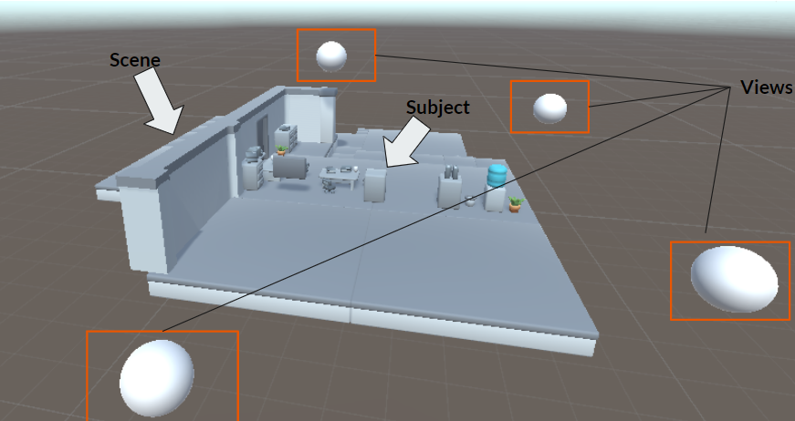
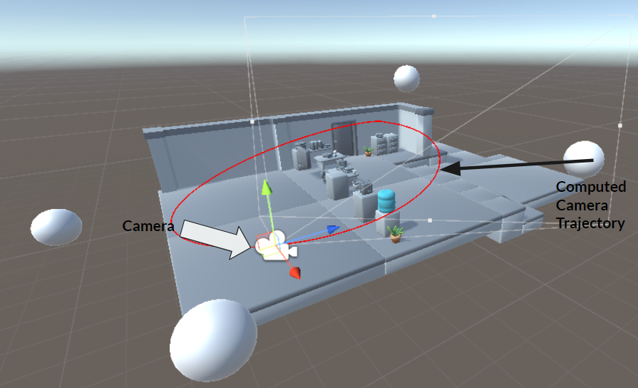

# camera-tracking

The objective of this repository is to propose a Unity3D module which allows to realize
a camera trajectory tracking of an object by providing only a limited amount of information,
namely a few points.

  

  figure: an example of a camera tracking

# Tutorial

* Create a basic 3D Unity project
* Add the script "trajectoire.cs" in the project assets
  * Add to the object "Main Camera" the component (scripts) "trajectoire.cs"
* Place an object in the scene: the subject
  * Create a tag "sujet"
  * Assign to this object the tag "sujet"
* Add observers around the object (e.g. 4 balls forming a square around the subject)
  * Create a tag "points"
  * Assign to all observers the tag "points"
* Play

# Model 

The trajectory of the camera will be modeled by a spline model (approximation) from
control points previously defined. The rotations of the camera will be calculated by a model of quaternions and a spherical approximation. These choices are justified by the nature we wanted to give to our project. We wish to model a camera tracking
around a fixed subject for several observers distributed in the scene.

Scene description            |  Camera trajectory computing
:-------------------------:|:-------------------------:
  |  

## Closed splines: advantages and disadvantages

The modeling of an approximating or interpolating curve by a single polynomial presents
many disadvantages for our camera movement. In the case where the degree of the curve is high
we end up with very few shape effects, which makes the movement monotomous. We
also want to have local control the trajectory points. This is not possible
with this kind of model. The oscillations that these polynomials can cause
unstability. A closed spline model avoids all these problems!

## Algorithm

Concerning the splines part, we used the B-splines algorithm. This
subdivision method is divided into 2 steps:
- Duplicate the control points
- Take n times (n the degree) the middle of two consecutive points in the control polynomial.

This algorithm allows us to obtain the set of points which constitutes the closing curve.
Concerning the quaternion part, we used a method provided by Unity "LookRotation". This method allows to obtain the rotation vector. Using these two algorithms,
we obtain the desired result.
